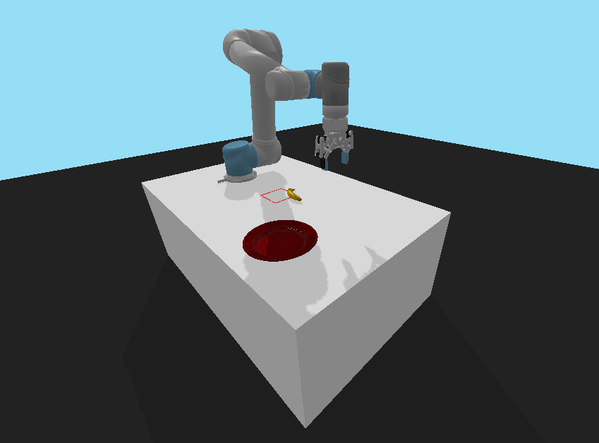

# HIAL-2025 Course Project

## Introduction
In this group project, you will utilize preference-based learning and imitation learning methods to train control policies for a robot manipulation task. 

## Task Environment
The target task is a robot food-serving task built base on [panda-gym](https://github.com/qgallouedec/panda-gym/tree/v2.0.2), where a robot arm needs to learn a control policy to pick up a banana that is randomly placed in a food preparation area, and place it on the plate for food serving. 
For more high-level details regarding the code structure, refer to Section 2 and Section 3 in [this paper](https://arxiv.org/pdf/2106.13687).



### State Space
The state of the task is defined as a dictionary, including keys of "observation", "achieved_goal", and "desired_goal".
The value of each key is a 1d np array. More specifically:
```
state["observation"] = np.array([ee_pos_x, ee_pos_y, ee_pos_z, 
                                 ee_vel_x, ee_vel_y, ee_vel_z, finger_width, 
                                 obj_pos_x, obj_pos_y, obj_pos_z, 
                                 obj_rot_x, obj_rot_y, obj_rot_z,
                                 obj_vel_x, obj_vel_y, obj_vel_z,
                                 obj_ang_vel_x, obj_ang_vel_y, obj_ang_vel_z])

state["achieved_goal"] = np.array([obj_pos_x, obj_pos_y, obj_pos_z])

state["desired_goal"] = np.array([target_pos_x, target_pos_y, target_pos_z])
```
For this robot food-serving task, the desired goal position is fixed and given, defined as the center of the red plate.
The values of the observation and the desired goal will change at each time step in accordance with the physical interaction between the robot and the banana object.
More details can be found in [pick_and_place.py](./envs/tasks/pick_and_place.py).

**Tips for training:** To facilitate policy training, we recommend flattening the state space by concatenating the "observation" and "achieved_goal".
You can realize it by using the reconstruct_state() function in [env_wrappers](./utils/env_wrappers.py).

### Action space
The action of the task is defined as a 1d np array, including the target 3d position of the robot end effector and the target finger width for the current time step.
More specifically,
```
action = np.array([target_ee_pos_x_t, target_ee_pos_y_t, target_ee_pos_z_t, target_finger_width_t])
```
More details can be found in [ur_robot.py](./envs/tasks/ur_robot.py).

### Reward
The task is designed with a sparse reward function. The robot will get a positive reward of +1000.0 if it manages to place the banana at the plate.
Otherwise, the robot will only get a reward of -1.0 at each step. 
More details can be found in [task_envs.py](./envs/task_envs.py).

### Termination 
An episode will terminate immediately if the banana is placed on the plate, 
or will terminate if the episode reaches its maximum length of 150 steps.
More details can be found in [task_envs.py](./envs/task_envs.py).

### Example on creating the task
It is very easy to create the task environment. You can do it by:
```commandline
env = PnPNewRobotEnv(render=True) # feel free to set render=False if you don't need to visualize the environment, which may save your training time
env = ActionNormalizer(env) # used to normalize the action space into the range of [-1, 1] for better training performance
env = ResetWrapper(env=env) # used to enable the env to be reset to any given state
env = TimeLimitWrapper(env=env, max_steps=150) # used to set the maximum episode length of 150 
```
Make sure to use all these 4 lines when you want to create your task environment. Refer to [test_env.py](./utils/test_env.py) for how to roll out in the environment episodically.
More details about ActionNormalizer, ResetWrapper, and TimeLimitWrapper can be found in [env_wrappers.py](./utils/env_wrappers.py). 


## Installation

1. Create a conda environment under python 3.8 and activate it in your terminal. Make sure you already downloaded and installed [Anaconda](https://www.anaconda.com/download/success) on your laptop before running the following commands in the terminal:

    ```
    $ conda create --name hial_project_env python=3.8
    $ conda activate hial_project_env
    ```
2. Install the [panda-gym](https://github.com/qgallouedec/panda-gym/tree/v2.0.2) environment under the version of 2.0.2:
   ```
   $ pip install panda-gym==2.0.2
    ```
   Notice: If you are on the Windows system and encounter the issue of "error: Microsoft Visual C++ 14.0 or greater is required. Get it with "Microsoft C++ Build Tools": https://visualstudio.microsoft.com/visual-cpp-build-tools/", refer to [this post](https://stackoverflow.com/questions/64261546/how-to-solve-error-microsoft-visual-c-14-0-or-greater-is-required-when-inst) for the solution.
3. Downgrade the gym version to 0.25.2 for compatibility concerns:
   ```
   $ pip install gym==0.25.2
    ```
4. Install the library of APReL following the instructions [here](https://github.com/Stanford-ILIAD/APReL).

   Notice: If you are a Windows user, or a MacOS user but run into troubles with ffmpeg, check this [post](https://stackoverflow.com/questions/48486281/ffmpeg-osx-error-while-writing-file-unrecognized-option-preset-error-splitt) and try to install it directly via conda:
   ```
   $ conda install -c conda-forge ffmpeg=4.2.2
    ```
5. After installing the APReL library, remember to go back to the parent directory (e.g., if you installed APReL at "/Desktop/APReL/", then go back to the directory of "/Desktop/"), and clone the hial_project repository under this parent directory:
   ``` 
   $ git clone https://github.com/MH-Hou/hial_project.git
    ```
   Notice: If you haven't installed git on your laptop, follow the instructions [here](https://git-scm.com/book/en/v2/Getting-Started-Installing-Git) and install git before you use the commend of "git clone" in your terminal.
## Examples
1. We have prepared 20 human-expert demos for you under the folder of /demo_data/PickAndPlace/, including episodic trajectories of states, actions, rewards, next states, and dones (i.e., whether an episode is terminated or not).
    
    If you want to check and load these demos, first go to the directory of /utilis if you haven't done that:
   ```
   $ cd hial_project/utils
   ```
    Then run the script of load_demos.py:
   ```
   $ python3 load_demos.py
   ```
    You should be able to see demos replaying in the simulator environment like below:

    <br>
    

    The code in [load_demos.py](./utils/load_demos.py) will be useful when you want to generate mp4 files as comparisons for humans to provide feedback in preference-based learning.

## Project Assignment
###1. Recover reward function via preference-based learning
* create a file named pref_learn.py under the directory of [alg](./alg/).
* in this pref_learn.py script, write your code to recover the reward function for the robot food-serving task using the [APReL](https://github.com/Stanford-ILIAD/APReL) library:
  * design your own features of the recovered reward and implement the feature function given an episodic trajectory
  * **write your code to generate 30 video clips of episodic trajectories, including 20 clips of given expert demos and 10 clips of trajectories with random actions.**
    The human teacher will later provide feedback whenever given a comparison between two trajectories chosen from these 30 trajectories. 
    And the way they provide feedback is by watching the clips of the chosen trajectories and give their preference using keyboard.
  * utilize APReL to write your code to recover the reward function based on your designed feature function and generated clips.
    More specifically, the human teacher is allowed to give feedback on 10 comparison queries in total. More code-wise procedures can be found in simple.py of APReL.
  * save the learned weights for your designed reward feature as a csv file named "final_feature_weights" under the directory of alg.

###2. Policy training via RL from Demonstrations with the learned reward function
* create a file named policy_learn.py under the diretory of [alg](./alg/).
* in this policy_learn.py, write your code to learn robot control policy using RL from Demonstrations with your learned reward function:
  * choose your favorite RLfD method (e.g., AWAC) as the underlying policy learning algorithm
  * load the given 20 expert demonstrations into the demo replay buffer of RLfD before policy training starts
  * train your policy episodically with your learned reward function. More specifically, write your code to realize a training loop where
    the robot first roll-outs its current policy for one episode, recovers the rewards for this episode given this roll-out trajectory, saves the trajectory into the
    replay buffer, then updates the control policy
  * train your policy for a maximum of 500k environment steps, and save your policy models every 1k steps during the training process
  * to report your results, plot the policy learning curve during the training process every 1k steps, with x-axis as the number of environment steps and
    y-axis as the **average success rate** of your trained policy at the current step. 
    
    For every data point, you should get the value of it by calculating the average success rate across 10 test runs. 
    And for each test run, you should:
    * randomly initialize the task environment (i.e., env.reset())
    * roll out your saved policy model of the current training step
    * check whether the robot succeeded or not for the current test run

###(Optional) Extra credits:
* Realize online policy training with RLfD and preference-based learning, and report your results. In other words, there will be no two separate phases for training. Instead, during every episode of the learning loop, the robot will:
  * ask for human feedback on certain amount of trajectory-pair comparisons
  * recover a new reward function for the current training episode
  * roll out the current policy and recover the rewards based on just learned reward function
  * update the policy
  * add the rolled out trajectory to the trajectory set of the preference-based learning, and generate the video clip of it for future comparison
  

## Useful Resources
1. (Highly recommended) You can find a clean implementation and the original paper of the Advantage-Weighted Actor-Critic (AWAC) algorithm [here](https://github.com/hari-sikchi/AWAC)
2. You can also find the implementations of a set of other IL algorithms [here](https://github.com/HumanCompatibleAI/imitation)
